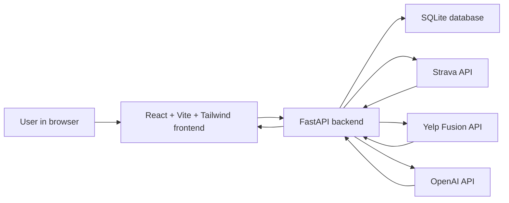

# AI Recovery & Post-Workout Feast Architect

AI Recovery & Post-Workout Feast Architect is a full-stack prototype that turns a recent Strava workout into a restaurant-based recovery meal plan.

The app connects:

- **Strava** for the athlete's latest workout
- **Yelp Fusion** for nearby restaurant discovery
- **OpenAI** for a structured recovery meal recommendation
- **React** for a simple local dashboard

This project is built for local development and beginner-friendly demos.

## Architecture



## Project Structure

```text
.
  backend/
    app/
      auth/
      routers/
      services/
      config.py
      database.py
      main.py
      models.py
    .env.example
    requirements.txt
  frontend/
    src/
      App.jsx
      index.css
      main.jsx
    .env.example
    package.json
    vite.config.js
```

## BEGINNER STARTUP INSTRUCTIONS

Backend:

```bash
cd backend
python -m venv venv
source venv/bin/activate
pip install -r requirements.txt
uvicorn app.main:app --reload
```

Frontend:

```bash
cd frontend
npm install
npm run dev
```

## Local Setup

### 1. Backend Environment

Create a backend environment file:

```bash
cd backend
cp -n .env.example .env
```

Open `backend/.env` and fill in your real keys:

```text
STRAVA_CLIENT_ID=""
STRAVA_CLIENT_SECRET=""
STRAVA_REDIRECT_URI="http://127.0.0.1:8000/auth/strava/callback"
APP_BASE_URL="http://127.0.0.1:8000"
FRONTEND_BASE_URL="http://localhost:5173"
YELP_API_KEY=""
OPENAI_API_KEY=""
OPENAI_MODEL="gpt-4o-mini"
```

Never commit `backend/.env`.

### 2. Frontend Environment

Create a frontend environment file:

```bash
cd frontend
cp -n .env.example .env
```

The default value points to the local backend:

```text
VITE_API_BASE_URL="http://127.0.0.1:8000"
```

### 3. Strava Developer Setup

Create a Strava API app at:

```text
https://www.strava.com/settings/api
```

For local development:

```text
Website: http://127.0.0.1:8000
Authorization Callback Domain: 127.0.0.1
Redirect URI: http://127.0.0.1:8000/auth/strava/callback
```

## Running Locally

Start the backend:

```bash
cd backend
python -m venv venv
source venv/bin/activate
pip install -r requirements.txt
uvicorn app.main:app --reload
```

Backend URL:

```text
http://127.0.0.1:8000
```

Start the frontend in a second terminal:

```bash
cd frontend
npm install
npm run dev
```

Frontend URL:

```text
http://localhost:5173
```

## Demo Flow

1. Start the backend.
2. Start the frontend.
3. Open `http://localhost:5173`.
4. Click **Connect Strava**.
5. Approve Strava access.
6. The app returns to the dashboard and saves your connected Strava athlete locally in the browser.
7. Confirm that the dashboard says **Strava connected**.
8. Use your current location or confirm the city and ZIP Code.
9. Choose a cuisine.
10. Click **Generate Recovery Feast**.
11. Review the workout, restaurant, AI meal recommendation, and **Claim Your Table** link.

## Screenshots

Screenshots can be added here after the app is running locally.

Suggested screenshots:

- Dashboard before generating a plan
- Recovery feast result
- Strava callback success page

## API List

### Core

- `GET /`
- `GET /health`

### Strava

- `GET /auth/strava/login`
- `GET /auth/strava/callback`
- `GET /activities/{athlete_id}`

After successful OAuth, the callback redirects to the frontend with `athlete_id` and `firstname` query parameters. The frontend saves those values in `localStorage`, so users do not need to type their athlete ID manually.

### Yelp

- `GET /restaurants/search?latitude=...&longitude=...&cuisine=...`

### OpenAI

- `POST /recommendations/meal`

### Full Recovery Flow

- `POST /recovery-plan`

Example body:

```json
{
  "athlete_id": 123,
  "latitude": 38.88,
  "longitude": -77.10,
  "cuisine": "Italian"
}
```

## SQLite Notes

The backend uses SQLite for local development.

The database file is created automatically when the backend starts:

```text
backend/recovery_feast.db
```

No migrations are required for this prototype. SQLAlchemy creates the current tables at startup.

## Public Repository Safety

This repository is prepared for public GitHub pushes.

The root `.gitignore` excludes:

- `.env` files
- Python virtual environments
- `node_modules`
- SQLite databases
- `__pycache__`
- frontend build output
- npm cache files

Before pushing publicly, run:

```bash
git status --short
```

Make sure no real secrets appear in tracked files.

## Future Roadmap

- Add proper database migrations with Alembic
- Add user accounts
- Add saved recovery plans
- Add restaurant filtering controls
- Add production deployment configuration
- Add automated tests
- Add screenshots to this README

## Final local QA checklist

[ ] Backend ready
[ ] Frontend ready
[ ] Environment variables complete
[ ] Strava auth ready
[ ] Yelp integration ready
[ ] OpenAI integration ready
[ ] Local demo ready
